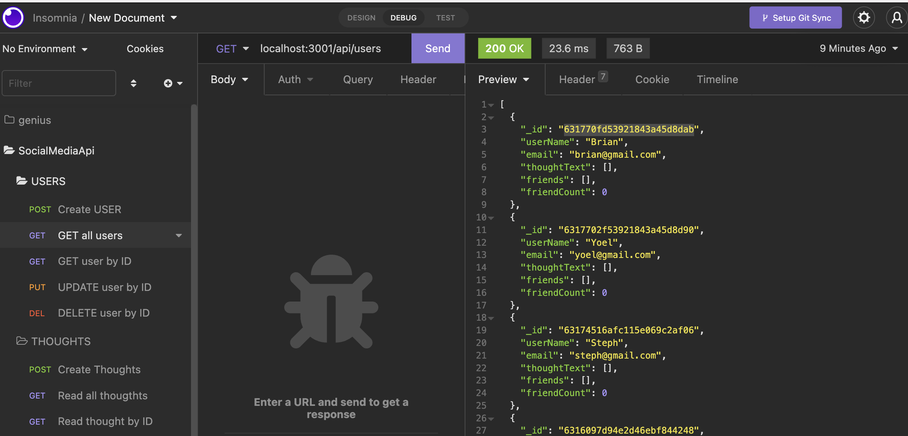
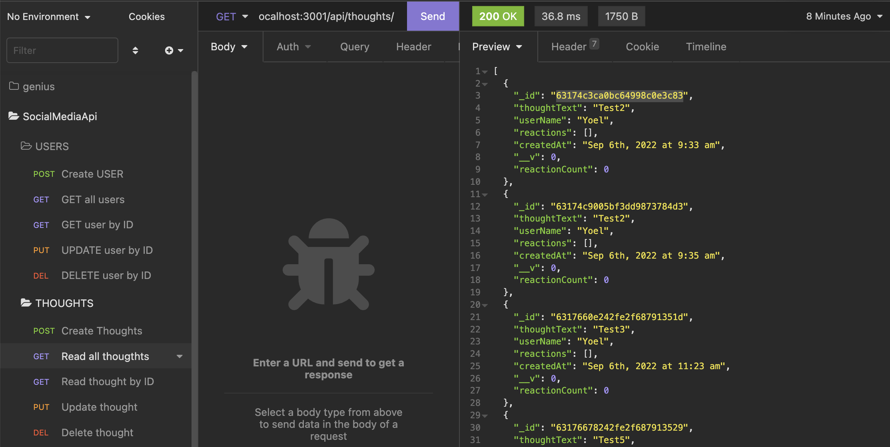

# Social-Network-API

This is a API for social network made with MongoDB and mongoose.

### Github : https://github.com/fumixer/Social-Network-API

### Work through video : https://drive.google.com/file/d/1gw_RUcN5193EuymrFVIrDL0ctg2_RsKP/view?usp=sharing

### Screenshot
*User route

*Thought route

### Technologies

* MongoDB
* mongoose
* node.js
* npm
* express

